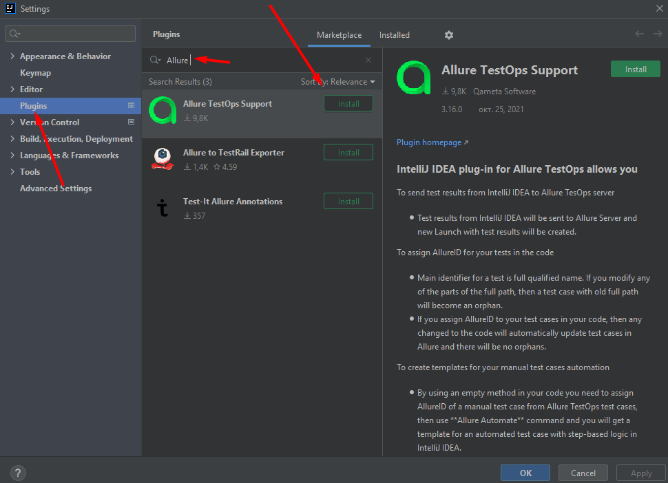

## 1. Creating a project for writing test cases as code

### 1.1. Install Java 17 
#### 1.2 - Download JDK 17
Open the browser and search for Download JDK 17.

####  1.3 - Install JDK on windows
1. Now execute the JDK installer by double-clicking it. It might ask system permission before starting the installation. Click on yes to allow the installer to execute itself. It shows the installer welcome screen.
2. Click the Next Button to initiate the installation process. The next screen shows options to change the installation path. We can change the installation location on this screen if required.
3. Now click the Next Button to start the installation. It will show the progress.
4. It shows the success screen after completing the installation.

5. Now open the Command Prompt and type the command java -version to confirm whether it's installed successfully.

6. It might show the message - java is not recognized as an internal or external command or show the previously installed version. In order to start using the JDK installed by us from the command prompt, we might be required to set the environment variable. You can follow the below-mentioned steps to do so.

`Right Click -> My Computer(This PC) -> Properties -> Advanced System Settings`

7. The above steps will open the Windows settings panel.

8. Now click the Environment Variables Button, select Path under the System Variables section, and click the Edit Button. We need to add the path of installed JDK to the system Path.

Notes: `The installer might add the path to System Path. We can delete it`

9. Remove the path of the previously installed JDK. Also, update JAVA_HOME in case it's already set. Now click on New Button and add the path to the installed JDK bin which is C:\java\oracle\jdk-17\bin in my case as shown in Fig 9. Press the OK Button 3 times to close all the windows. This sets the JDK 17 on system environment variables to access the same from the console.

10. Now again open the console and test the Java version.

####  1.3 - Install JDK on Mac

1. Double click the DMG file downloaded to start installing Oracle JDK 17 on Mac. It will mount the DMG disk and shows the installer. Make sure that you have gone through the updated License Agreement of Oracle JDK.
2. Now double-click the installer to start installing Java 17 on Mac. The installer shows the Welcome Screen.
3. Click the Continue Button to start the installation. It provides options to choose the installation type.
4. You may change the installation location by clicking the Go Back Button. It did not allow me to change the installation location on macOS Catalina. Now click the Install Button to start installing Java 17 on Mac. It also asks for permission to complete the installation.

5. It shows the success message after completing the installation.
6. Now unmount the DMG image by right-clicking it.

7. We can check the JDK version to confirm the installation.

Note: `This is all about installing Oracle JDK 17 on Mac systems including macOS Sierra, High Sierra, Mojave, Catalina, and Big Sur.`

## 2. Install intellij idea
IntelliJ IDEA is a cross-platform IDE that provides consistent experience on the Windows, macOS, and Linux operating systems.

IntelliJ IDEA is available in the following editions:

Community Edition is free and open-source, licensed under Apache 2.0. It provides all the basic features for JVM and Android development.

IntelliJ IDEA Ultimate is commercial, distributed with a 30-day trial period. It provides additional tools and features for web and enterprise development.

### 2.1 Standalone installation

Install IntelliJ IDEA manually to manage the location of every instance and all the configuration files. For example, if you have a policy that requires specific install locations.

To create a desktop entry, do one of the following:

 - On the Welcome screen, click Configure | Create Desktop Entry

 - From the main menu, click Tools | Create Desktop Entry

When you run IntelliJ IDEA for the first time, you can take several steps to complete the installation, customize your instance, and start working with the IDE.

For more information, see Run IntelliJ IDEA for the first time.

For information about the location of the default IDE directories with user-specific files, see Directories used by the IDE.

### 2.2 Silent installation on Windows

Silent installation is performed without any user interface. It can be used by network administrators to install IntelliJ IDEA on a number of machines and avoid interrupting other users.

To perform silent install, run the installer with the following switches:

 - /S: Enable silent install

 - /CONFIG: Specify the path to the silent configuration file

 - /D: Specify the path to the installation directory

This parameter must be the last in the command line and it should not contain any quotes even if the path contains blank spaces.

For example: `ideaIU.exe /S /CONFIG=d:\temp\silent.config /D=d:\IDE\IntelliJ IDEA Ultimate`

To check for issues during the installation process, add the /LOG switch with the log file path and name between the /S and /D parameters. The installer will generate the specified log file. 

For example: `ideaIU.exe /S /CONFIG=d:\temp\silent.config /LOG=d:\JetBrains\IDEA\install.log /D=d:\IDE\IntelliJ IDEA Ultimate`

### 2.3 Install as a snap package on Linux

You can install IntelliJ IDEA as a self-contained snap package. Since snaps update automatically, your IntelliJ IDEA installation will always be up to date.

## 3. Registration on github and connect with project

### 3.1 Setting up Git

1. Download and install the latest version of Git.
2. Set your username in Git.
3. Set your commit email address in Git.

### 3.2 Next steps: Authenticating with GitHub from Git

When you connect to a GitHub repository from Git, you'll need to authenticate with GitHub using either HTTPS or SSH.

`Note: You can authenticate to GitHub using GitHub CLI, for either HTTP or SSH. For more information, see gh auth login.`

#### 3.2.2 Connecting over HTTPS (recommended)
If you clone with HTTPS, you can cache your GitHub credentials in Git using a credential helper.

#### 3.2.3 Connecting over SSH
If you clone with SSH, you must generate SSH keys on each computer you use to push or pull from GitHub.

### 3.3 Create a repository
1. In the upper-right corner of any page, use the  drop-down menu, and select New repository.

2. Type a short, memorable name for your repository. For example, "hello-world".

3. Optionally, add a description of your repository. For example, "My first repository on GitHub."

4. Choose a repository visibility.

5. Select Initialize this repository with a README.

6. Click Create repository.

### 3.4 Integration with Github

## 4. Create project in idea
1. Create project.

2. Choose maven, java version 17 and click next.

3. Enter name of the project and click button 'Finish'.

## 5. Structure of project

`Folder "src" -> "test" -> "java" -> "Test"` - for creating new tests and annotations.

`File .gitignore` - for adding untracked files. 

`File pom.xml` - for adding dependencies.

`File README.md` - description of creating and using of the project.

## 6. Customization allure testOps
### 6.1 Install plugin Allure TestOps
File -> Setting...

Choose allure TestOps Support

### 6.2 Plug-in connection settings

Plug-in connection settings

    Go to Tools -> Allure -> Authorize
  - Provide Allure TestOps URL
  - Provide personal access token
  - Click OK

If there is no error message, then authentication is completed and you can start using the integration.

### 6.3 Generate secret token on Allure TestOps side
This authentication token will be used by Jenkins to authenticate in Allure TestOps server.

1. Log in to Allure TestOps with dedicated account you are going to use to upload test results. That could be your profile as well.
2. Go to user’s profile.

3. In the section API tokens click a green button that says Create.
4. Name your API token and click Submit. Always give meaningful names to all the configuration.
5. Copy the token and save it in a safe place as it cannot be retrieved by Allure TestOps means.
### 6.4 Upload test results to Allure TestOps from IntelliJ IDEA
1. Run tests on your development environment, i.e. on your local machine.
2. Select folder with allure results in the project tree and then right click the folder.
3. In the context menu select Upload Results to Allure

4. Select a Project to sent the test results and name your launch

5. The results will be available in the Allure TestOps in section Launches of the project selected in step 4.

### 6.4 Launches in allure

1. Open launches in JSFiller project.
2. Click on your previous uploaded result.
3. Click on your test and see details.

